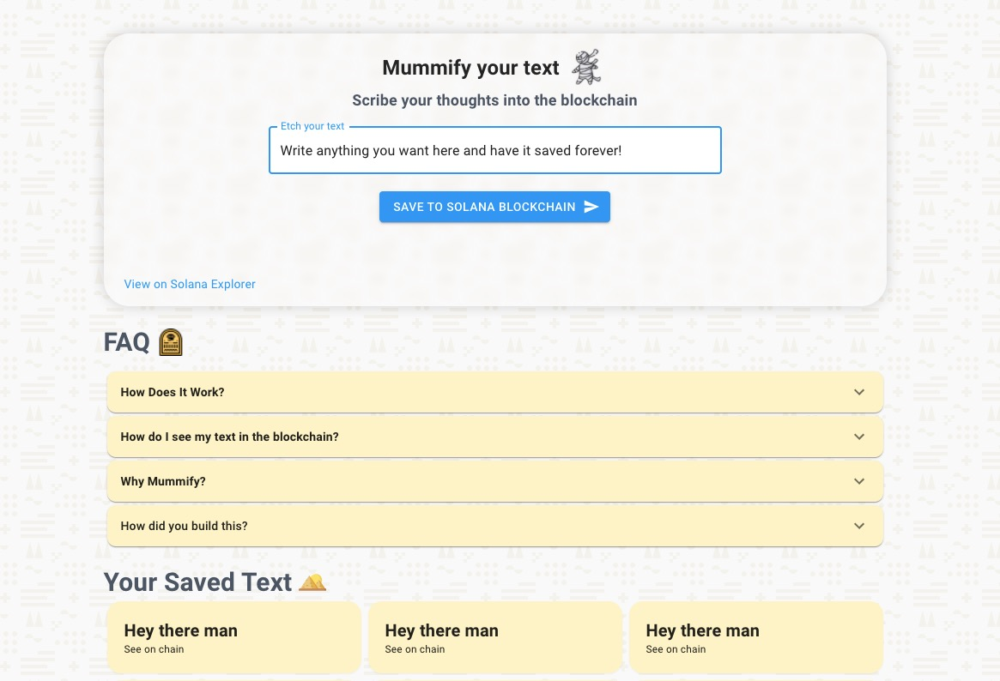
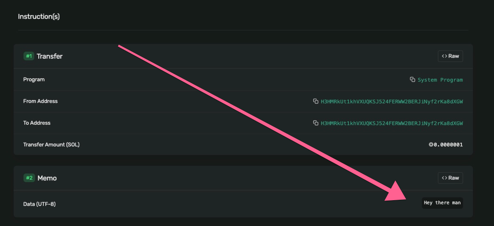

# Mummify - Save Any Text into Solana Forver

See the [live demo](https://mummify.vercel.app)

# Mummify permanently inscribes your text into the blockchain. 

Never get your text deleted again!
It uses the Solana Blockchain Memo Program to inscribe your text into a transaction. When you click "See on chain", scroll down and you'll see that a memo of your text is included with the transaction. All transactions are in the dev network and are simply sending SOL to and from the same wallet.

Mummify adds your text as a Memo to a Solana transaction. If you click on your transaction and scroll to the Memo section you should see this:

# How did you build this?

This is a fork of the spl token wallet and it's been modified so it can only send internal transactions that also include memos. Full source code available here! We use React + TailwindCSS and host with Next JS. Built by Ed + Ced

# Why did you build this?

It's for the Solana defi hackathon.